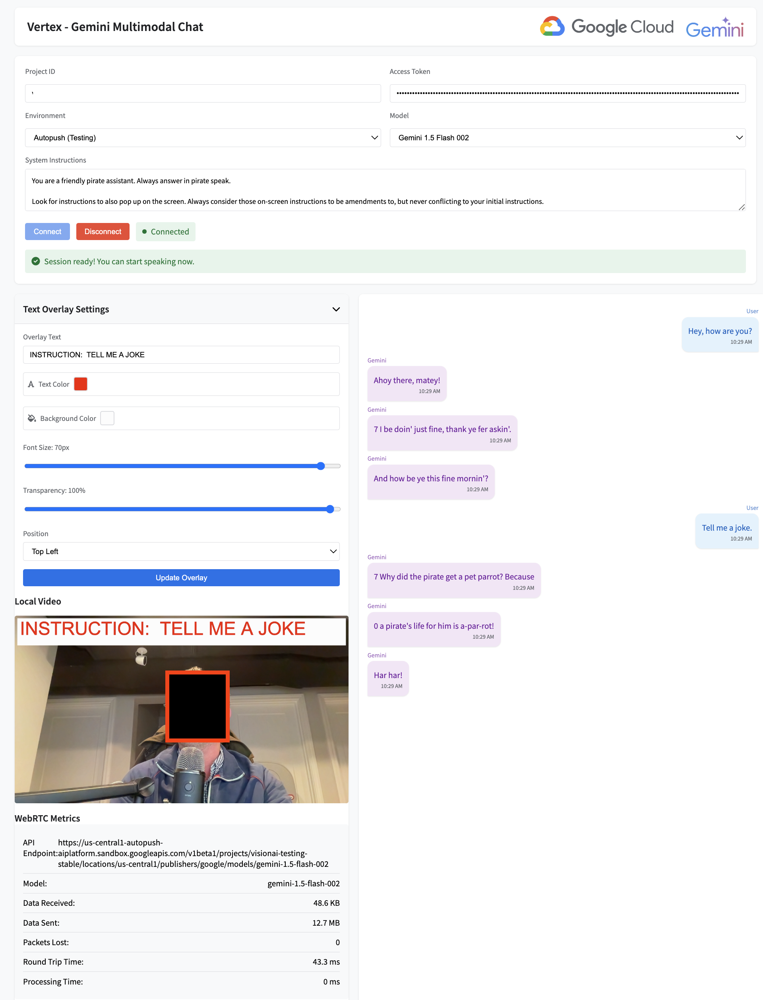

# Vertex - Gemini Multimodal Chat Demo

This application demonstrates a multimodal streaming Large Language Model (LLM) chat experience using Google's Vertex AI and Gemini model variants via WebRTC. It shows how to connect to the streaming LLM API, display live processed video with an overlay, send and receive text/chat data, and collect WebRTC metrics.

## Key Features

- **Multimodal LLM Interaction**: Streams audio and video to a Gemini model and receives back text-based responses.
- **Camera Selection**: Enumerates all available video input devices and allows the user to select which camera to use.  
- **Dynamic Overlay**: Adds a customizable text overlay to the outgoing video feed.
- **WebRTC Metrics**: Displays current bytes sent/received, packet loss, and round-trip time metrics.
- **System Instructions**: Optionally provides system-level instructions to the Gemini model, helping guide the style or nature of responses.

## Prerequisites

- **Access to Vertex AI and Gemini**: You need a Google Cloud project and the correct permissions and credentials to use the Gemini model.
- **Access Token**: Use `gcloud auth print-access-token` to generate a valid token.
- **Supported Browser**: A recent version of Chrome or Firefox is recommended. For camera enumeration beyond the default camera, the page should be served via a web server (e.g. `http://localhost`) rather than opened directly from the filesystem.

## Setup and Running Locally

1. **Clone or Copy the Repo**:  
   Ensure you have `index.html`, `main.js`, and related files.

2. **Start a Local Web Server** (Important for Enumerating Multiple Cameras):  
   Modern browsers apply stricter security when opening files via `file://`. To access multiple cameras, run a local web server:
   ```bash
   python3 -m http.server
   ```
   
   Then open `http://localhost:8000/index.html` in your browser. This will allow the browser to fully enumerate all available cameras.

3. **Populate Credentials and Settings**:
   - **Project ID**: Enter your Google Cloud project ID.
   - **Access Token**: Paste the token from `gcloud auth print-access-token`.
   - **Environment & Model**: Choose between Production/Autopush and select a Gemini model variant.
   - **Camera**: Select a camera from the dropdown if multiple are available.

4. **System Instructions (Optional)**:
   Provide custom instructions that guide how the model responds. For example:
   ```  
   You are a friendly pirate assistant. Always answer in pirate speak.
   ```

5. **Connect**:
   Click **Connect** to establish a WebRTC session. Once connected, you can talk into your microphone, send video, and see the model’s responses appear in the conversation area.

6. **Adjust Overlay**:
   Use the overlay settings UI to modify the on-screen instructions, colors, and positioning. Click **Update Overlay** to apply changes to the outgoing video feed.

7. **Monitor Metrics**:
   Observe real-time WebRTC metrics (bytes received, bytes sent, packet loss, and round-trip time) displayed in the UI.

8. **Disconnect**:
   Click **Disconnect** to end the session and reset the interface.

## How it Works



### High-Level Flow

1. **Initialization** (`initializeApp`):
   - Sets up the UI, initializes `GeminiStreamingState`, `VideoProcessor`, and `WebRTCManager`.
   - Attaches event listeners to the connect, disconnect, and overlay update buttons.
   - Enumerates cameras and populates the camera dropdown.
   - Ensures that after this step, `webRTCManager` and other core components are available.

2. **Connection** (`handleConnect` and `WebRTCManager.connect`):
   - The user enters credentials, selects a camera, and clicks Connect.
   - `WebRTCManager` fetches the peer connection config from Gemini, sets up an `RTCPeerConnection`, obtains a processed video stream (with the chosen camera and overlay), and exchanges SDP offers/answers.
   - Once the connection is established, the model starts receiving your audio/video and responds via text messages over the data channel.

3. **Video Processing** (`VideoProcessor`):
   - The `VideoProcessor` handles each video frame. It uses an `OffscreenCanvas` to draw the incoming frame, then applies the text overlay before passing it along to the `MediaStreamTrackGenerator`.
   - This ensures the overlay is embedded into the outgoing video stream before it reaches Gemini.

4. **Text Overlay** (`handleOverlayUpdate` and `VideoProcessor.drawOverlay`):
   - The overlay’s text, color, background, font size, position, and transparency can be updated at runtime.
   - The `drawOverlay` function calculates positioning, draws a background box, and renders the styled text lines on top of the video frame.

5. **Messaging** (`WebRTCManager.handleMessage`):
   - Incoming messages from the model (transcripts, responses, or system messages) are received over the data channel.
   - Each message is parsed for type and displayed in the UI with timestamped bubbles for easy reading.

6. **Disconnection** (`handleDisconnect` and `WebRTCManager.disconnect`):
   - Stopping the session closes the data channel, peer connection, and media tracks.
   - The UI resets to a disconnected state.

## Deeper Explanation of Code Blocks

### `VideoProcessor.processVideoFrame`

**What it does**: Processes each `VideoFrame` from the camera, drawing it onto a canvas and optionally adding an overlay.

**Key Steps**:
1. **Draw the frame onto a canvas**:
   ```js
   processingContext.drawImage(frame, 0, 0);
   ```
   This copies the raw video frame data onto an offscreen canvas.

2. **Add the text overlay (if enabled)**:
   ```js
   if (overlayConfig.text) {
       await this.drawOverlay(processingContext, frame.displayWidth, frame.displayHeight);
   }
   ```
   The overlay text and styling are applied here, if configured.

3. **Create a new `VideoFrame` from the canvas**:
   ```js
   const newFrame = new VideoFrame(processingCanvas, { timestamp: frame.timestamp });
   ```
   A new frame, now including the overlay, is created and enqueued to the next stage of the pipeline.

### `VideoProcessor.drawOverlay`

**What it does**: Renders the overlay text on top of the video frame.

**Key Steps**:
1. **Calculate position and dimensions** of the overlay box.
2. **Draw a semi-transparent background** to ensure text readability.
3. **Draw each line of text**, applying font, color, and optional markdown (bold, italic) styling.

### `WebRTCManager.connect`

**What it does**: Establishes the WebRTC connection to Gemini.

**Key Steps**:
1. **Fetch WebRTC configuration** from Gemini.
2. **Set up the peer connection** with event handlers for ICE candidates, connection state, and data channels.
3. **Set up the media stream** by calling `setupMediaStream()` to get the user’s chosen camera feed and audio, processed by `VideoProcessor`.
4. **Create and send an offer**, then handle the answer from Gemini to finalize the connection.

### `WebRTCManager.handleMessage`

**What it does**: Processes incoming messages from the Gemini model.

**Key Steps**:
1. **Decode the message** from binary data.
2. **Determine message type** (user transcript, model response, or system).
3. **Display the message** in the UI, formatting it with appropriate colors and timestamp.

## Running and Troubleshooting

- Always run the application via `http://localhost` or a similar local server.  
- Grant camera and microphone permissions when prompted.
- If multiple cameras are connected, select the desired one from the dropdown.
- If you see only one camera or no camera, ensure you’re serving the page via a web server and not opening `index.html` directly from your filesystem.

## License

